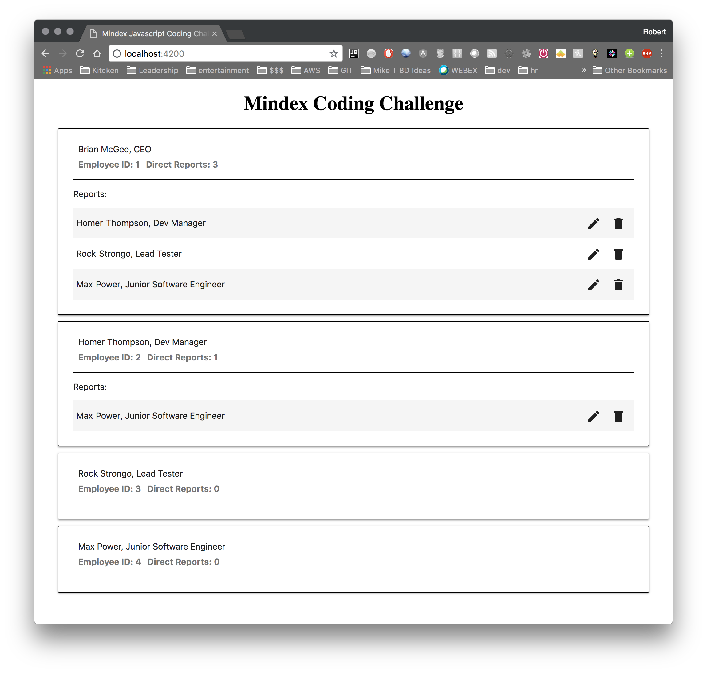
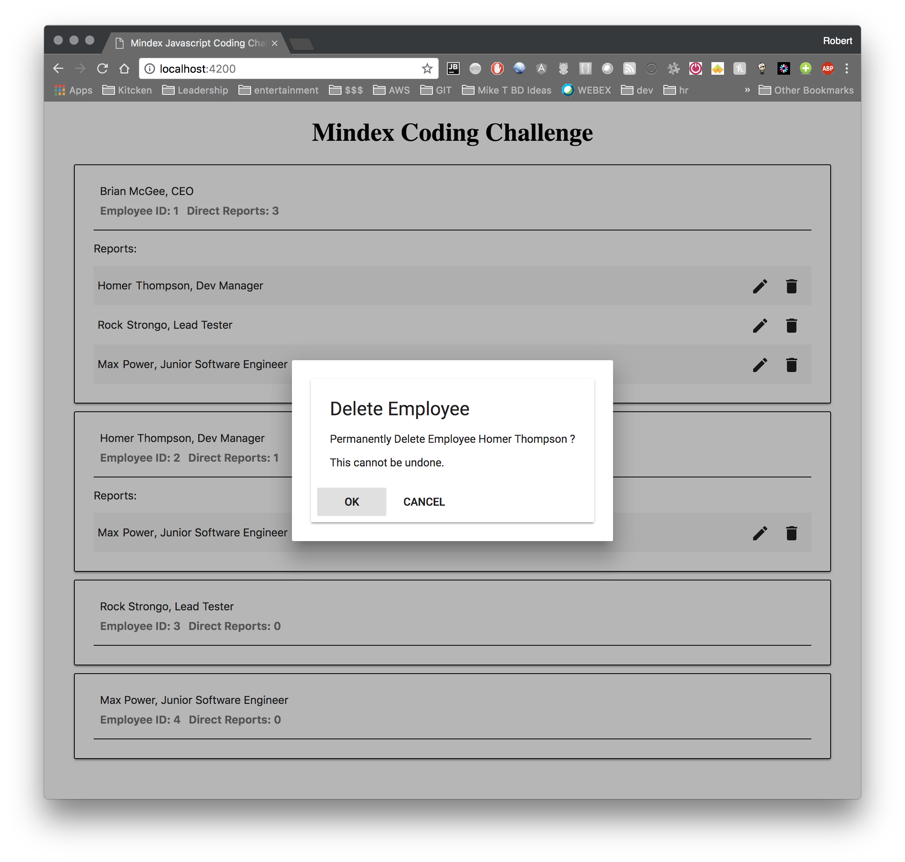
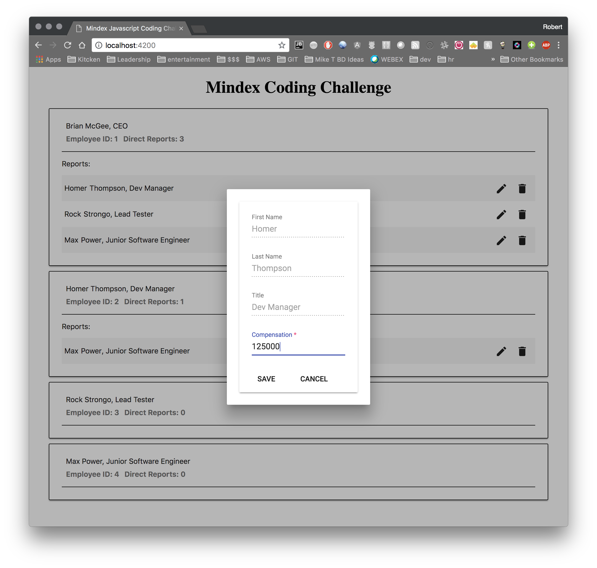

# Mindex Angular 6 Coding Challenge

## What's Provided
An [Angular 6](https://angular.io/) employee web application has been created and bootstrapped using an in browser "database".
Basic unit and e2e tests have been created.  [Angular Material Design](https://material.angular.io/) and [Flex Layout](https://github.com/angular/flex-layout)
have been added as dependencies.  Feel free to add or use other dependencies as you see fit.

## Expectatons
- Spend a few hours alone on this.
- Your solution should **not** be colaborative & should be your own work.
- Use of Google or other on-line resources to get you over a technical hump is acceptable.
- **Understand the code you write, you may be asked to explain it.**
- A complete solution should be the goal, but an **incomplete solution is acceptable**. Code what you know how to code well. 
- It is recommended that you write unit tests and/or e2e tests to throughly verify existing and any **added** functionality.
- The challenge can be sufficiantly completed without the use of the **Angular RxJS Library**, but it is recommended.
- Ask questions if something isn't clear. The Talent Aquisition Advisor you are working with knows how to reach a Sr. Mindex developer to resolve any questons you may have.

### Initial setup

Install [Node](https://nodejs.org/en/) version 8+.  After installation run `npm install` at the root of this project.

### Development server

Run `npm start` for a dev server. Navigate to `http://localhost:4200/`. The app will automatically reload if you change any of the source files.

### Build

Run `npm run build` to build the project. The build artifacts will be stored in the `dist/` directory. Use the `--prod` flag for a production build.

### Running unit tests

Run `npm test` to execute the unit tests via [Karma](https://karma-runner.github.io).

### Running end-to-end tests

Run `npm run e2e` to execute the end-to-end tests via [Protractor](http://www.protractortest.org/).

### Further help

To get more help on the Angular CLI use `ng help` or go check out the [Angular CLI README](https://github.com/angular/angular-cli/blob/master/README.md).

## What to Implement

The tasks for this challenge will build a simple user interface that will allow a user to view a listing of employees and their direct reports. Thew challenge will ask you to build and layout the page as shown and to implement a couple CRUD operations on the listing of direct reports, specifically to UPDATE the compensation and DELETE the direct report. As a final task, the challenge with ask you to add styling to the page components.

### Task 1

1. Browse the code base and familiarize yourself with the file structure. If you've used the Angular-CLI, the directory structure should be familiar.
2. Add a new compensation property of type number to the [employee](./src/app/employee.ts) type.

### Task 2

1. Add the type to the [employee component](./src/app/employee/employee.component.ts). The [employee](./src/app/employee.ts) type may have the property directReports which is an array of other employee ids who report directly to this employee.
2. On the [employee component](./src/app/employee/employee.component.ts) add a new field that collects the employees reporting to this person, directly and indirectly & display the **total** number of these employees in the header of the card.

### Task 3

1. On the [employee view template](./src/app/employee/employee.component.html) add functionality to list the direct reports, if any, and & style the rows to disambiguate the reports.
2. On each report row, create two buttons. One for **EDITING** a row item and one for **DELETING** a row item.  
3. Implement an **EventEmmiter** on the **Employee Component** that will emit an event to the parent **Employee List Component** to handle the CRUD action. The **Employee List compoent** should handle initiating and observing the service request (EDIT/DELETE).

### Task 4

1. Create and register a new app-level component to show a dialog to the user. This dialog will be used to either show a Delete confirmation, or to present the user with a form by which they can update the employee compensaton:

### Task 5

1. Implement in the **Employee List Component** the handler to initialte and observe the service calls to either delete or update the employee being serviced in the previous task.

### Task 6

1. Style the page to your liking, ... show us what you got. Have fun.
